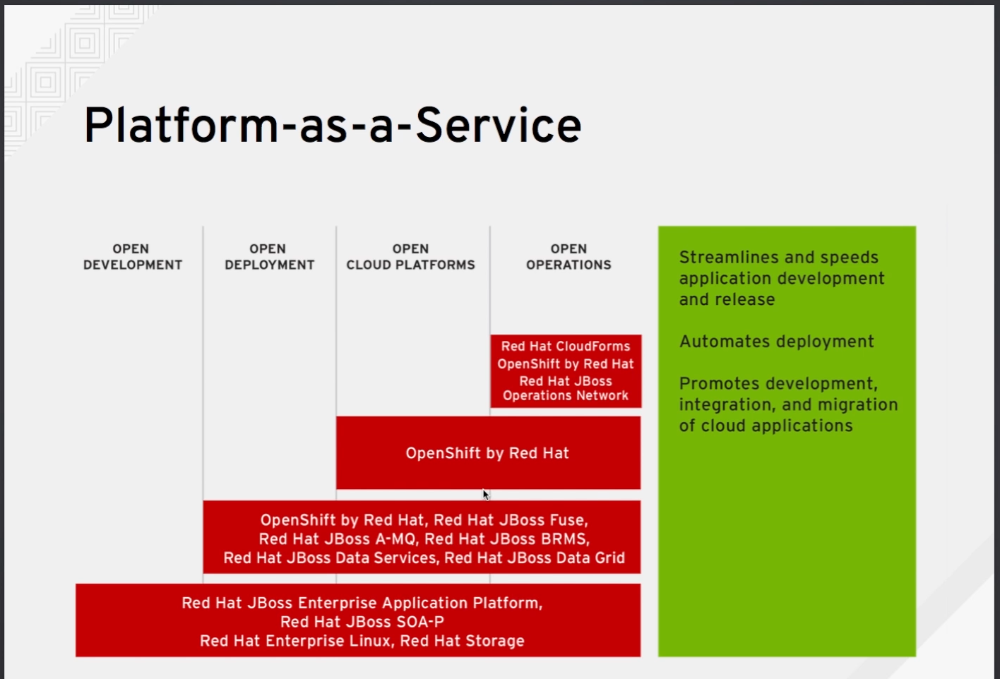

## 클라우드의 정의

클라우드 컴퓨팅은 유비쿼터스와 편의성 그리고 구성가능한 컴퓨팅 리소스의 공유 풀, 온디맨드 네트워크 엑세스를 쉐어하기 위한 모듈이다.

그럼의로 클라우드는 
네트워크, 서버, 스토리지, 애플리케이션 그리고 서비스도 포함 될 수 있습니다

여기서 목표는 이러한 인스턴스와 가상 시스템을 제공하고 출시하며 수정이 필요한경우 서비스 공급업체의 지원없이 위의 작업을 수행하는 것을 말한다.

클라우드 소비자는 자신의 인스턴스에 사영하고자 하는 컴퓨팅 리소스(컴퓨터 성능)를 결정합니다.

클라우드 컴퓨팅에는 몇 가지 본질적인 특성이 있습니다.

| 특성 | |
| --- | --- |
| self-sevice  | 소비자가 원하는 인스턴스를 자신의 컴퓨팅 리소스로 프로비저닝(제공) 할 수 있게끔 하는 것입니다. |
| multitenancy | 여러 명의 클라우드 소비자가 기본 하드웨어를 공유할 수 있도록 하는 것|
| elasticity | 수평적 확장이 가능하며 필요에 따라 리소스를 추가하거나 제거할 수 있어야 합니다 |
| telemetry | 리소스를 모니터링하고 서비스 공급자와 클라우드 소비자가 이를 확인할 수 있어야 합니다 |

## 워크로드

왼쪽의 이미지 처럼 기존 컴퓨터는 램과 저장공간 및 성능을 올리기 위해 수직적으로 쌓아가며 성능을 올렸다고 하면

클라우드는 왼쪽처럼 수평적으로 인스턴스의 추가를 통한 총합 성능을 높였다고 할 수 있다

## 클라우드 모델 종류

3가지의 모델 종류가 있다
| 종류 | 내용 |
| --- | --- |
| parivate cloud | 데이터와 같은 부분은 회사에서 가지고 있고 애플리케이션 같은 서비스 부분을 클라우드에서 정해진 리소스를 제공하는 방식 |
| hybrid cloud | 일상때는 기본 리소스를 제공해주다가 클라우드 버스트가 생겼을 경우 퍼블릭처럼 제공|
| public cloud | 데이터 또한 제공해주기 때문에 관리가 쉽다 |

> [!TIP]
> 클라우드버스트 : 클라우드 버스트란
> 서비스 수요가 급증하는 현상

## IaaS(infrastructure as a service)

인프라 서비스 제공을 이야기할 때 사용하는 용어입니다

가상 시스템이나 인스턴스, 서버, 네트워크 리소스, 추가 스토리지 리소스와 비슷하게 자체적 데이터 센터를 확장할 수 있다고 고려하는것이 인프라스트럭쳐입니다

핵심으로는 서비스 카탈로그를 보유하는 것이며 
퍼블릭클라우드에서는 프로비저닝 라이프사이클을 자동화 할 수 있습니다.
식별하는 정책을 정의하는 것입니다.

red hat cloudforms 

## Paas(Platform as a Service)

Red hat의 하이브리드 쿨라우드 방식

하지만 서버 가상화 계층을 제공합니다

